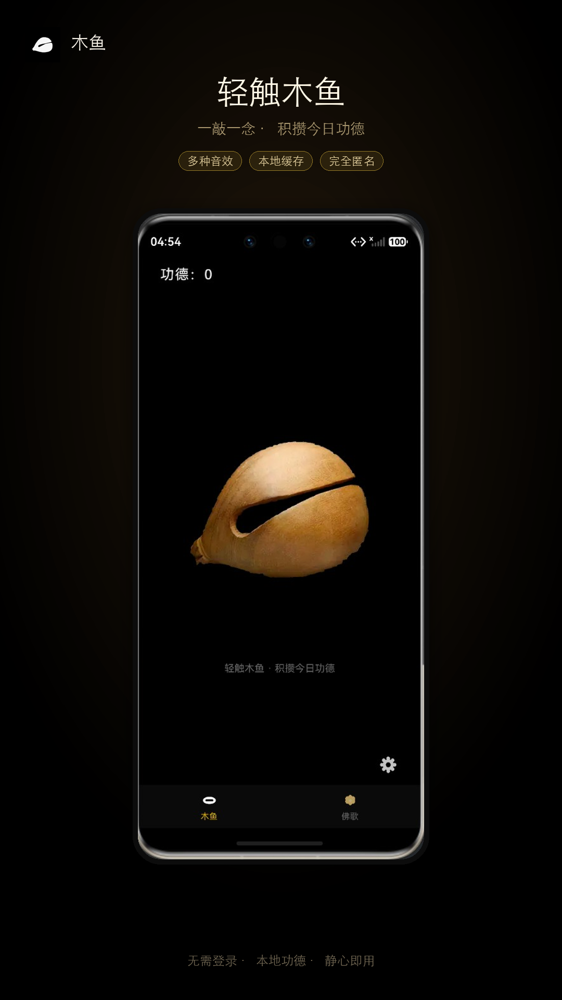
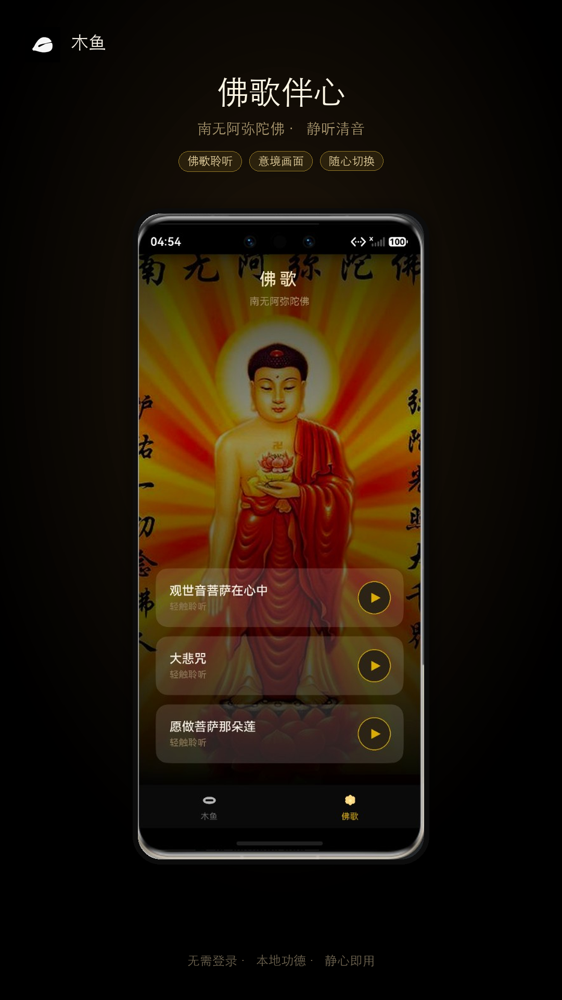
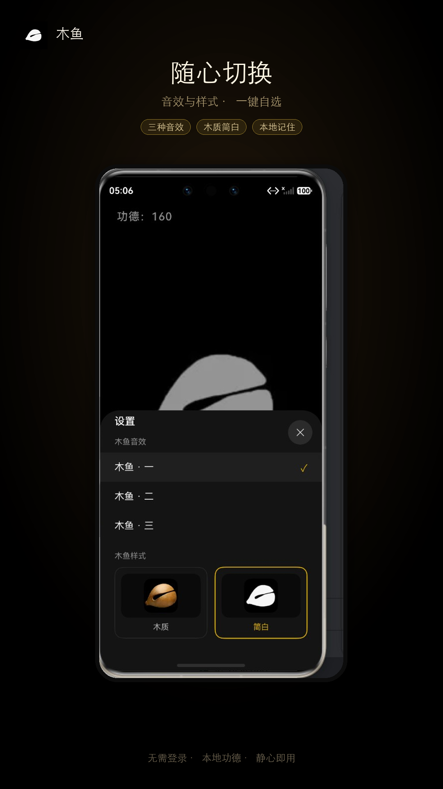

<p align="center">
  
</p>

<h1 align="center">木鱼 · HarmonyOS</h1>

<p align="center">
  <b>极简静心工具</b> · 敲木鱼积功德 · 听佛歌伴心<br/>
  无需登录 · 完全匿名 · 本地缓存
</p>

<p align="center">
  <a href="https://github.com/jiangshang-dev/muyu/stargazers"></a>
  
  
  
</p>

---

## ⭐ 先 Star，再白嫖？免谈

开源不易，代码、UI、音效与文档都是一点点攒出来的。

> **如果你觉得好用、好看、有帮助：请先点右上角 Star。**  
> **禁止白嫖。** 白嫖不 Star、提需求当甲方、改完不回馈的，请绕道。  
> Star 是对开源作者最便宜也最实在的支持。

**点个 Star 再 Clone，功德 +10。** 🙏

---

## 预览

| 木鱼 | 佛歌 | 设置 |
|:---:|:---:|:---:|
|  |  |  |

### 木鱼样式

<p align="center">
  
  &nbsp;&nbsp;
  
</p>

---

## 功能

- **木鱼敲击**：轻触发声，每次功德 **+10**，今日累计本地保存，跨天自动清零  
- **音效切换**：三种木鱼音效，设置里一键试听  
- **双样式**：木质 / 简白，暗黑主题协调  
- **佛歌页**：观世音菩萨在心中、大悲咒、愿做菩萨那朵莲；意境图随机切换 + 呼吸动画  
- **隐私友好**：无需登录、不采集账号、数据仅存本机  

---

## 技术栈

- HarmonyOS NEXT / API 6.x  
- ArkTS + ArkUI  
- AVPlayer 播放音效与佛歌  
- Preferences 本地功德缓存  

包名：`com.xiaobai.muyu`

---

## 快速开始

### 环境

- DevEco Studio（支持 HarmonyOS NEXT）  
- 真机或模拟器  

### 运行

```bash
# 用 DevEco Studio 打开本仓库根目录
# File → Open → 选择 muyu 工程
# 连接设备后 Run
```

或使用工程内构建能力（依本机 DevEco / hvigor 配置）：

```bash
# 在 DevEco Studio 中同步依赖后编译运行即可
```

### 资源说明

| 路径 | 说明 |
|------|------|
| `entry/src/main/resources/rawfile/` | 木鱼音效、佛歌音频 |
| `entry/src/main/resources/base/media/` | 界面图片与图标 |
| `docs/images/` | README 预览图 |

---

## 目录结构

```
muyu/
├── AppScope/                 # 应用级配置与图标
├── entry/src/main/ets/
│   ├── pages/Index.ets       # Tab：木鱼 / 佛歌
│   ├── components/           # 木鱼页、佛歌页、浮动功德
│   └── utils/                # 功德缓存、音频播放
├── entry/src/main/resources/ # 媒体与字符串
└── docs/images/              # 文档配图
```

---

## 使用约定（反白嫖）

1. **Star 优先**：Clone / Fork / 提 Issue / 提 PR 前，请先 Star。  
2. **尊重作者**：可学习、可二次创作，请注明来源，不要删作者信息后假装原创上架。  
3. **合理提需**：欢迎建议，但不是免费外包；没有 Star 与基本礼貌的需求可直接忽略。  
4. **商用请沟通**：用于上架获利或商业分发，请先联系作者授权（开源 ≠ 随便白嫖商用）。  

如果你只想拿代码、从不反馈、还指责作者——**这个仓库不欢迎你。**

---

## 贡献

欢迎 PR / Issue（先 Star）：

- Bug 修复、体验优化、文案与无障碍  
- 新音效 / 新佛歌资源（注意版权）  
- 文档与截图完善  

提交前请在真机简单自测木鱼敲击与佛歌播放。

---

## 致谢

- 佛歌与音效资源请遵守各自版权；本仓库仅作学习与个人静心用途示例  
- 感谢每一位 **点了 Star** 的道友  

---

## License

若仓库根目录含 `LICENSE` 文件，以该文件为准。  
未另行约定前：**禁止未授权的商业白嫖与去署名分发。**

---

<p align="center">
  <b>一敲一念，心安自在。</b><br/>
  看完了？回去给个 <a href="https://github.com/jiangshang-dev/muyu">⭐ Star</a> 再走。<br/>
  <sub>白嫖可耻，Star 光荣。</sub>
</p>
